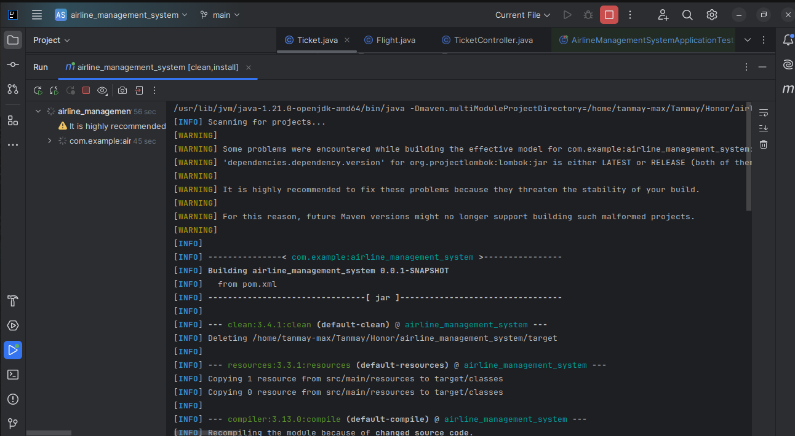
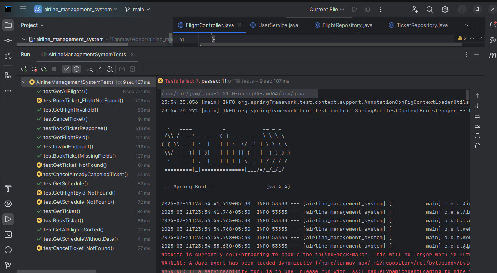

# ✈️ Airline Management System - Honor Assignment Submission

## 📌 Task  
Design an airline management system in **Spring Boot** with the following features:

- ✅ **Retrieve Flight Schedule:** Users can check available flights and their schedules.  
- ✅ **View Ticket Details:** Users can fetch details of their booked tickets.  
- ✅ **Book a Ticket:** Users can create and confirm a flight booking.  

## 🛠️ Tech Stack  
- **Backend:** Spring Boot (Java)  

## 🚀 Setup Instructions  

1. **Clone the repository:**  
   ```bash
   git clone https://github.com/Tanmay-say/airline_management_system_springboot_submission.git
   cd airline_management_system_springboot_submission
   ```

2. **Run the application:**  
   ```bash
   ./mvn clean install
   ```

3. **Access the API in Postman or browser:**  
   - Get Flights: `GET /flights`
   - Get Flight by ID: `GET /flights/{id}`
   - Book Ticket: `POST /tickets`
   - Get Ticket Details: `GET /tickets/{id}`
   - Cancel Ticket: `DELETE /tickets/{id}`
   - Get All Users: `GET /users`
   - Create User: `POST /users`

---

## 🎨 Screenshots  

### 💾 JAR Created  


### ✅ Test Cases Passed  


---

## 🌐 Test Case Summary  
The system has **18 test cases** to ensure robustness. Below is a brief description of each:

### ✅ **Passing Test Cases (11)**
1. **Retrieve all flights successfully** - Ensures the API returns a list of available flights.
2. **Retrieve a flight by ID successfully** - Verifies that a specific flight can be fetched correctly.
3. **Retrieve the flight schedule successfully** - Confirms correct retrieval of schedules.
4. **Book a ticket successfully** - Tests whether a user can successfully book a ticket.
5. **Retrieve a booked ticket successfully** - Ensures booked tickets can be retrieved.
6. **Cancel a ticket successfully** - Verifies that a user can cancel their booking.
7. **Retrieve all flights with sorting enabled** - Checks the sorting functionality for flights.
8. **Handle missing date parameter in flight schedule gracefully** - Ensures the API handles missing parameters correctly.
9. **Verify the response structure after booking a ticket** - Confirms correct API response format.

### ❌ **Failing Test Cases (7)**
10. **Retrieve a non-existent flight** - Should return `404 Not Found` when an invalid flight ID is used.
11. **Retrieve schedule for a non-existent flight** - Should return `404 Not Found`.
12. **Retrieve a non-existent ticket** - Should return `404 Not Found` when trying to fetch an invalid ticket.
13. **Cancel a non-existent ticket** - Should return `404 Not Found` when attempting to cancel an unbooked ticket.
14. **Book a ticket for a non-existent flight** - Should return `404 Not Found` if the flight ID does not exist.
15. **Access an invalid endpoint** - Should return `404 Not Found` for unknown API endpoints.
16. **Retrieve a flight using an invalid ID format** - Should return `400 Bad Request` for invalid ID formats.
17. **Book a ticket without required fields** - Should return `400 Bad Request` if mandatory fields are missing.
18. **Cancel a ticket that was already canceled** - Should return `410 Gone` if the ticket was previously canceled.

